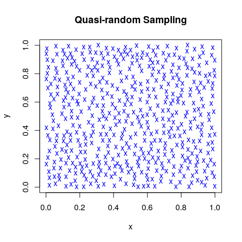

# Random Numbers

## Random Number Generators (RNGs)

  * (*Pseudo*-)Random number generators in Base R

        RNGkind(kind = "default", normal.kind = NULL)
        set.seed(seed)  # i.e., seed <- .Random.seed 

        runif(n)        # or: rnorm(n); rexp(n)
        sample(x, size, replace = FALSE, prob = NULL)

    Wichmann-Hill: $6.9\cdot10^{12}$;
    Marsaglia-Multicarry: $1.1\cdot10^{18}$  
    Super-Duper: $4.6\cdot 10^{18}$;
    **Mersenne-Twister**: $\approx 10^{6000}$  
    Knuth-TAOCP-2002: $6.8 \cdot 10^{38}$;
    L'Ecuyer-CMRG: $3.1\cdot 10^{57}$

  * Recommended 'help' pages:

        ?Random       # details on RNG in R, 'kinds', 'seeds', etc.
        ?Random.user  # user-supplied random number generation


## dqrng and qrng Packages

  * **dqrng**: Fast pseudo-random number generator

        dqrunif()`, `dqrnorm()`, `dqrexp()
        dqset.seed()`, `dqRNGkind(kind = "Mersenne-Twister")

    64-bit Mersenne-Twister, pcg64,  
    Xoroshiro128+, Xoshiro256+ (defaults in Erlang and Lua),  
    Threefry (64 bit engine provided by **sitmo**)    

  * **qrng**: *Quasi*-random numbers in high dimensions

        korobov(n, d = 1, generator, randomize = FALSE)
        ghalton(n, d = 1, method = c("generalized", "halton"))
        sobol  (n, d = 1, randomize = FALSE, skip = 0)

    Developed specifically for Monte-Carlo applications


## Pseudo, quasi, and true RNGs

  * *Pseudo-random numbers*  
    are sequences of numbers whose statistical properties
    approximate the properties of theoretical random number
    sequences.

  * *Quasi-random numbers*  
    are 'low-discrepancy sequences', that is the proportion of
    numbers falling into an arbitrary subset is close to the
    measure of that subset.

  * *True random numbers*  
    are generated from physical processes that are known to behave
    like statistically random 'noise' signals.


## *True* Random Number Generators

  * **random**  
    RANDOM.ORG "samples atmospheric noise via radio tuned to an
    unused broadcasting frequency together with a skew correction 
    algorithm by John von Neumann."

        library(random); N = 10000  # maximum request
        rn <- randomNumbers(n = N, min = 0, max = N, col = 2)/N

  * **qrandom**  
    ANU Quantum Random Number Generator "generates true random 
    numbers in real-time by measuring the quantum fluctuations 
    of the vacuum."

        library(qrandom); N = 10000  # maximum request: 10^5 [1024]
        rn <- qrandomunif(n = N, a = 0, b = 1)


## Generate Random Distributions

If $u$ are uniformly distributed random numbers (in $[0, 1]$)  
and $F$ is a *cumulative distribution function*, then the numbers  
$F^{-1}(u)$ are random numbers in this statistical distribution.

Example: Normal (Gaussian) distribution  
( with mean = 0.0 and sd = 1.0)


```r
    x  <- runif(1000)
    xn <- qnorm(x)      # qnorm() is the inverse of pnorm()
    summary(xn)
```

```
##     Min.  1st Qu.   Median     Mean  3rd Qu.     Max. 
## -3.06333 -0.67881 -0.03556 -0.01626  0.65103  2.91529
```

Alternative: Ziggurat algorithm


## More RNGs in Packages

  * **randaes** (2012)  
    cryptographic random number generator, based on AES

  * **rngwell19937** (2014)  
    long period linear random number generator WELL19937a

  * **rstream** (2017)  
    streams of random numbers from different sources

  * **Tinflex** (2017)  
    generator for arbitrary distributions with piecewise  
    twice differentiable densities

  * **UnivRNG** and **MultiRNG** (2018)  
    uni-/multivariate random number generation for quite  
    a number of different distributions


## User-defined RNGs and Tools

  * *?Random.user*  
    "Function `RNGkind()` allows user-coded uniform and normal 
    random number generators to be supplied."

        dyn.load("<user.lib>")
        RNGkind(kind = "user-supplied")

  * **randtoolbox**  
    Toolbox for pseudo and quasi random number generation

  * **rngtools**  
    Utility functions for working with RNGs

  * **setRNG**  
    for compatibility with former S versions


## How to Write your own RNG in R?

  * Congruential random number generation

    $$x_{i+1} = (a x_i + c)\,\mathrm{mod}\,m$$

        e.g., m = 2^32,     a = 1103515245, c = 12345
        or    m = 2^31 - 1, a = 48271,      c = 0     (Lehmer RNGs)

  * Knuth-TAOCP-2002

    $$x_i = (x_{i-37} + x_{i-100})\,\mathrm{mod}\,2^{30}$$
    (and discard the first 2000 numbers)
  
See also the **randtoolbox** vignette, Dutang and Würtz (2009)  
*A note on random number generation*


---
**Knuth-TAOCP-2002** -- an R Implementation

    randTAOCP <- function(seed = NULL) {
        local({
            R <- vector(mode = "numeric", length = 2000)
            R[1:100] <- qrandom::qrandomunif(n = 100, a = 0, b = 1)
            for (k in 101:2000)
                R[k] <- (R[k-37] + R[k-100]) %% 1
            k <- 2000; i <- 2000 - 37; j <- 2000 - 100
            frand <- function() {
                k <<- (k %% 2000) + 1
                i <<- (i %% 2000) + 1
                j <<- (j %% 2000) + 1
                z <- (R[i] + R[j]) %% 1
                R[k] <<- z
                return(z)
            }
            return(frand)
        })
    }


# Tests for RNGs

## Testing Random Number Generators

  * **RDieHarder**  
    R Interface to the 'DieHarder' RNG Test Suite

    Not even 'Mersenne Twister' satisfies all these tests!

  * Simple RNG tests, e.g.
    * Spectral test in d dimensions
    * Permutation rank distribution
    * Monte Carlo value for $\pi$
    * 'Greatest Common Divisor' test
    * Birthday spacing test

    * *Random Walk* tests


## Example: 3D Spectral Test

Search for lattice structure (in all dimensions)


## Example: Image Sampling

Mitchell's best-candidate algorithm for Poisson disk distribution



# Example: Random Walks

## "Irrfahrten und ihre Folgen"

**Definition** (Pearson 1905)  
A **random walk** consists of a succession of random steps on some discrete grid. An elementary example is the **symmetric** random walk on the integers that starts at 0 and at each step moves +1 or −1 with equal probability.

**Theorem** (Polya 1921).  
*A symmetric random walk in one or two dimensions will return  
to its starting point* almost certainly *(i.e., with probability 1)*.

Applications in  
Queing models, Brownian motion, stock markets, animal behavior,
risk analysis, diffusion processes, game theory, ...

Random walks are fundamental for Markov processes.


## Visualization of Random Walks


## Original Project Idea

**Goal**

  * Generate a million or so example curves, starting and ending  
    in 0, by smoothing enough random walks (splines, etc.)
  * Store these curves in appropriate databases
  * Apply **Functional Data Analysis** (FDA) methods to classify,
    compare by similarity, and retrieve similar curves

**Problem**

  * Find enough nontrivial random walks returning to 0

  * **Or**:
    What is the probability that a random walk returns to 0
    after at most *n* steps?


## Random Walks Step-by-Step

```r
rwalk <- function(N, M) {
    result <- rep(0, N)
    for (i in 1:N) {
        steps <- 2
        a <- if (dqrunif(1) >= 0.5) 1 else -1
        a <- a + if (dqrunif(1) >= 0.5) 1 else -1
        while (a != 0) {
            steps <- steps + 2
            a <- a + if (dqrunif(1) >= 0.5) 1 else -1
            a <- a + if (dqrunif(1) >= 0.5) 1 else -1
            if (steps >= M) break
        }
        result[i] <- steps
    }
    result
}
```

Discussion on other, more compact approaches ?


## Probability Distribution of RWs


## Derive Minimum No. of Steps

```r
N <- 10000; M = 2048
result <- numeric(100)
for (i in 1:100) {              # 100 simulation runs
    no_steps <- rwalk(N, M)     # vector of step lengths
    r <- rle(sort(no_steps))    # 'run length encoding'
    x <- r$values               # steps
    y <- cumsum(r$lengths)/N    # probability
    ind <- which(y > 0.975)[1]  # where is p > 0.975
    result[i] <- x[ind]         # store no. of steps
}

summary(result)
##  ...
```

Repeat this for different uniform RNGs in `rwalk()`


## Simulation Results

Simulate 100 times and compute the 97.5% level:  
10000 random walks -- stopping at length 2048

    # with `runif()`
    > summary(result)
    ##  Min. 1st Qu.  Median    Mean 3rd Qu.    Max.
    ##   684     959    1018    1038    1120    1476

    # with `dqrunif()`
    > summary(result)
    ##  Min. 1st Qu.  Median    Mean 3rd Qu.    Max.
    ##   752     941    1013    1025    1108    1320

    # with `randTAoCP()`
    > summary(result)
    ##  Min. 1st Qu.  Median    Mean 3rd Qu.    Max. 
    ##   806     944    1003    1026    1098    1302 


## Theory of Random Walks

The probability for returning to zero for the first time after
exactly 2n steps is:
$$P(W = 2n) = {2(n-1) \choose n-1} \frac{1}{2^{2(n-1)}} \frac{1}{2n}$$


```r
n <- 1:512
a <- choose(2*(n-1), n-1)/2^(2*(n-1))/(2*n)
w <- c(0, cumsum(a))
cbind(2*c(510:512), w[510:512])
```

```
##      [,1]      [,2]
## [1,] 1020 0.9749989
## [2,] 1022 0.9750234
## [3,] 1024 0.9750478
```


## Remark about the $P = 0.99$ Case

`choose()` does not work for bigger numbers.  
We need to aply the 'arbitrary-precision' package **gmp**.

```r
n <- 1:3185
b2 <- as.bigz(2)
A <- chooseZ(b2*(n-1), n-1)/(b2^(b2*(n-1))*(b2*n))
W <- c(0, cumsum(as.numeric(A)))
cbind(2*c(3182:3185), W[3182:3185])
## [1,] 6364 0.9899971
## [2,] 6366 0.9899987
## [3,] 6368 0.9900002
## [4,] 6370 0.9900018
```


# Appendices

## JavaScript and R

Package **V8** provides an embedded JavaScript engine  
(On Linux, the user needs to install `libv8-dev`)

Since version 2.0 (2019-02-07) it supports ECMAScript 6    
i.e., version 6 that implements, e.g., 'collections'

    library(V8); js <- v8()
    js$console()
    js$eval("<JS code>")
    js$source("<file.js>")
    js$assign("var_name", <R object>)
    js$get("var_name")
    js$call("<JS function>", <args...>)

Objects will be exchanged using the JSON format.


## Random Walks with JavaScript

```js
function rwalk(N, M) {
    var result = new Array(N)
    var a = 0, steps
    for (var i = 0; i < N; i++) {
        steps = 2
        if (Math.random() >= 0.5) {a = 1} else {a = -1}
        if (Math.random() >= 0.5) {++a} else {--a}
        while (a != 0) {
            steps += 2
            if (Math.random() >= 0.5) {++a} else {--a}
            if (Math.random() >= 0.5) {++a} else {--a}
            if (steps >= M) break
        }
        result[i] = steps
    }
    return result
}
```

## Results with Javascript

Find probabilities with 1 million random walks:

```r
    library(V8)
    js <- v8()
    # js$eval("function rwalk(N, M) { ... }")
    js$source("rwalk.js")           #   user  system elapsed
    system.time(                    #  1.845   0.101   1.933 
        js$eval("var noStepsJS
                 noStepsJS = rwalk(10^6, 10^4)
                 undefined") )
    noStepsR <- js$get("noStepsJS")
    ...

    ## No. of steps for p >= 0.975: 1020
    ## No. of steps for p >= 0.990: 6380
```


## Julia and R

Package **JuliaCall** provides an R interface to Julia,  
a high-performance language for numerical computing.

Stable version 1.0 (2018-08-08) is backward-compatible.    

    library(JuliaCall); julia_setup()
    julia_console()
    julia_source("<file.jl>")
    julia_command("<Julia code>")
    julia_eval("var_name")
    julia_assign("<var_name>", <R object>)
    julia_call("<Julia function>", <args...>)

Objects will be exchanged using R6 and the JSON format.


## Random Walks with Julia

```julia
rwalk = function(N, M)
    result = zeros(Int, N)
    for i in 1:N
        steps = 2
        rand() >= 0.5 ?  a = 1 : a = -1
        rand() >= 0.5 ? a += 1 : a -= 1
        while a != 0
            steps += 2
            rand() >= 0.5 ? a += 1 : a -= 1
            rand() >= 0.5 ? a += 1 : a -= 1
            if steps >= M; break; end
        end
        result[i] = steps
    end
    return result
end
```

## Results with Julia

```r
    library(JuliaCall)
    julia_setup()

    js$source("rwalk.jl")
    julia_command("rw = rwalk(10, 10);")  # compile function
    system.time(
        no_steps <- julia_eval("rwalk(1000000, 10000)") )
    ##  user  system elapsed 
    ## 0.330   0.008   0.338 

    ...

    ## No. of steps for p >= 0.975: 1020
    ## No. of steps for p >= 0.990: 6348
```
