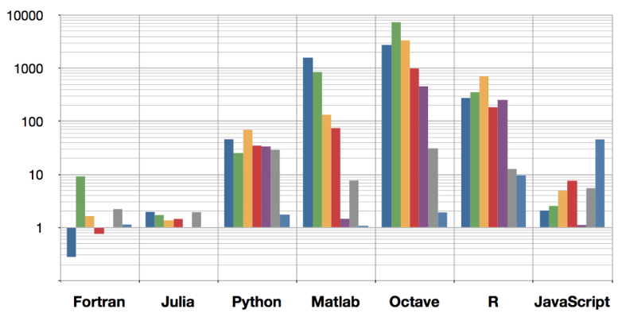

```{r setup, include=FALSE}
knitr::opts_chunk$set(echo = FALSE)
```


## R and Programming Languages

| Language | R Package |
|---------:|-----------|
| Fortran, C | R Base |
| C++ | Rcpp (e.g., RcppOctave) |
| Java | rJava (e.g., RWeka) |
| Python | rPython, pyRserve, PythonInR, XRPython |
| Julia | XRJulia |
| JavaScript | V8 |
| Scala | rscala |

## What is JavaScript?

"JavaScript is a high-level, dynamic, untyped, and interpreted programming language. It has been standardized in the ECMAScript language specification. Alongside HTML and CSS, it is one of the three essential technologies of World Wide Web content production; the majority of websites employ it and it is supported by all modern Web browsers without plug-ins."

<https://en.wikipedia.org/wiki/JavaScript>

"Despite its popularity, few know that JavaScript is a very nice dynamic object-oriented general-purpose programming language. How can this be a secret? Why is this language so misunderstood?"

*JavaScript: The World's Most Misunderstood Programming Language*  
<http://javascript.crockford.com/javascript.html>


## How fast is JavaScript?



(Source: Bezanson et al., Julia Vision, MIT 2013)


## R Packages using JavaScript

- **V8**, js (incl. CoffeeScript)
- **Shiny** and shinyjs
- **googleVis**, htmlidgets, slidify
- Plotting Libraries:
    * **plotly** (see also: rbokeh)
    * **vegalite**

- Other JS graphics libraries:
    * jStat, DT "DataTables"
    * leaflet, leafletR
    * networkD3, d3Network, visNetwork
    * qrage, scatterD3 "D3", ...


## R Package V8

  * **Title** Embedded JavaScript Engine

  * **Version** 1.0.0, March 3, 2016

  * **Description**

    "An R interface to Google's open source JavaScript engine.

    "V8 is written in C++ and implements ECMAScript as specified in ECMA-262, 5th edition.

    "In addition, this package implements typed arrays as specified in ECMA 6 used for high-performance computing and libraries compiled with 'emscripten'."

  * **License** MIT + file LICENSE


## Commands provided by V8

    library(V8)
    js <- v8()

* js$console()

* js$eval(" JavaScript code ...")

* js$assign("js_var_name", \<R object\>)

* js$get("js_var_name")

* js$source("filename.js")

* js$call("JavaScript function", args...)

(Objects will be exchanged using the JSON format.)


## JavaScript Console

```
> library(V8)
> js <- v8()
> js$console()
This is V8 version 3.15.11.18. Press ESC or CTRL+C to exit.
~ d = {};
[object Object]
~ d[1] = [1,2,3]; d[3] = [4]
4
~ for (var i = 1; i < 4; i++) {
  	print(d[i]);
  }
1,2,3
undefined
4
~<ESC>
Exiting V8 console.
>
```


## Can JavaScript packages be used?

  * `npm` cannot be used.

  * Any package that requires internet access, graphics,  
    or the file system is not going to work in plain V8.

    But there is quite a lot of stuff that does work.

  * Examples:

        //underscore.js -- functional programming helper
        js$source(system.file("js/underscore.js", package="V8"))

        //support for numerical and statistical applications
        js$source("math.js")
        js$sources("jStat.js")


## Package js and CoffeeScript

  * Package **js** validates JavaScript code and is capable of compiling
    CoffeeScript, i.e., converts CoffeeScript code to JavaScript.

    "[CoffeeScript] adds syntactic sugar inspired by Ruby, Python and Haskell in an effort to enhance JavaScript's brevity and readability." -- en.wikipedia.org

  * Example:

```
    > library(js)
    > coffee_compile("square = (x) -> x * x", TRUE)
    [1] "var square;
    square = function(x) {
      return x * x;
    };"
```


## Examples and Timing Comparisons

  * Example: Fibonacci sequence recursion

        R:          3.664 s             =>  150 : 1
        JS:         0.024 s

  * Example: Maximal sum subsequence

        R:          2.684 s             =>  335 : 1
        JS:         0.008 s
        R+Fortran:  0.012 s

  * Example: Simulating a random walk  
    (Compute the PDF of "return probabilities")

        R:   3050000 steps in 16 s      =>  200 : 1
        JS: 32000000 steps in 0.8 s


## Basic V8/JavaScript

  * Datatypes and variable declaration
    + `numeric` (double)
    + `string` (immutable)
    + `boolean` (true, false)

  * Vectors, matrices, arrays (are mutable)

  * Operators and control structures (as usual)

  * functions (first class) and scoping rules  
    (structures/objects are passed by reference)

  * objects with properties and methods  
    classes, prototypes, mix-ins, etc.


## Examples

The following examples are presented through Jupyter notebooks:

  * Fibonacci numbers and the Hofstadter Q sequence

  * Maximum subsequence problem  
    Maximal subrectangle problem

  * Mandelbrot set ("Apfelmännchen")

  * Empty rectangle problem

  * Knapsack problems

  * Hamiltonian cycles


## Example: Data Frames in R and JS

    > require(V8)
    > js <- v8()

    > js$assign("mydata", mtcars)
    > mydata <- js$get("mydata")   # an almost identical dataframe

    > js$source(system.file("js/underscore.js", package="V8"))
    > js$call("_.filter", mtcars, JS("function(x){return x.mpg < 15}"))

                         mpg cyl disp  hp drat    wt  qsec vs am gear carb
    Duster 360          14.3   8  360 245 3.21 3.570 15.84  0  0    3    4
    Cadillac Fleetwood  10.4   8  472 205 2.93 5.250 17.98  0  0    3    4
    Lincoln Continental 10.4   8  460 215 3.00 5.424 17.82  0  0    3    4
    Chrysler Imperial   14.7   8  440 230 3.23 5.345 17.42  0  0    3    4
    Camaro Z28          13.3   8  350 245 3.73 3.840 15.41  0  0    3    4

    


## Summary

  * V8 integrates JavaScript nicely into R,  
    data will be exchanged as JSON objects

  * V8 is well suited for numerical and scientific computations  
    involving loops and code that cannot be vectorized

  * The JavaScript engine can be 100-200 times faster than  
    pure (unvectorized, repetitive) R code

  * V8 cannot load JavaScript libraries that use network/disk I/O,  
    the event-loop, or DOM (i.e., the browser window), but it can  
    utilize algorithmic libraries (math.js, Jstat.js, sets.js, ...)

  * V8 implements ECMAscript 5, not the newer ECMAscript  
    version 6 that also implements, e.g., 'collections'


## References

  * D. Flanagan. *JavaScript: The Definite Guide*, Sixth Edition.  
    O'Reilly, 2011. [Covers ECMAScript 5.1]

  * M.MacMillan. *Data Structures & Algorithms with JavaScript*.  
    O'Reilly, 2014.

  * Mozilla Developer Network (MDN). *JavaScript*.  
    URL: https://developer.mozilla.org/en-US/docs/Web/JavaScript.
    [Covers ECMAScript 2016/17]

  * "Introduction to V8 for R", "Using NPM packages in V8".  
    Vignettes for the R package V8.

  * T. Burnham. *CoffeeScript: Accelerated JavaScript Development*.  
    Pracmatic Programmers, 2011.
