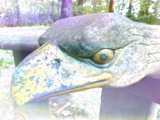

  
 

# Presentations
 
## Talks 2014 - 2020

### 2020

**Nichtlineare Regression in R**\
*Wiesbaden R User Group, December 2020*

> 'nls()' in Base R ist eine häufig verwendete Funktion zur "least-squares" 
> Schätzungen der Parameter eines nichtlinearen Modells; ihre Implementierung 
> hat jedoch schwerwiegende Probleme und Einschränkungen. Wir werden 
> Alternativen erörtern, die in R-Paketen verfügbar sind -- und auch, wie 
> Einschränkungen, z.B. Positivitätsbedingungen, für die gesuchten Parameter 
> einbezogen werden können.

[R Markdown notebook](https://rpubs.com/hwborchers/698786)

**R und das S4 Objekt-System**\
*Wiesbaden R User Group, September 2020*

> Beschreibt das S4 Klassensystem anhand einer Implementierung des Gauss'schen 
> Gesetzes zur Fehlerfortpflanzung; die notwendigen arithmetischen Operationen 
> werden als Operationen auf den S4 Objekten realisiert. Ein analoges Beispiel 
> für "dual numbers" findet man hier:

Implementation of [R Dual Numbers](https://github.com/hwborchers/RDualNumbers)

**The mlr3 package system**\
*R User Group, Heidelberg, Jul-Aug 2020*

> Duscussing the 'mlr3' packages with introduction, mlr3 learners (especially 
> Random Forest), prediction and accuracy, resampling and cross-validation, 
> as well as hyperparameter tuning.

[mlr3 examples](https://github.com/hwborchers/mlr3examples) Github repository

**Subgroup Discovery mit R**\
*Wiesbaden R User Group, June 2020*

> Subgroup Discovery (SD) ist eine Technik des beschreibenden und explorativen 
> Data Minings. Es werden 'interessante' Teilmengen der Daten identifiziert, in 
> Hinblick auf ein für die jeweilige Anwendung wichtiges Merkmal. SD ist von 
> praktischer Relevanz für wissenschaftliche wie geschäftliche Datenanalysen 
> und kann für Analysten wie Kunden überraschende Einblicke in die Daten
> liefern. Ein R Paket wird vorgestellt, das diese Methode implementiert.

[Slides](https://rpubs.com/hwborchers/630659) - the 'rsubgroup' package

### 2019

**JuliaCall: Calling Julia from R**  
*Github Page, 2017, Updated to Julia 1.0 in 2019*

> A short description of how to install JuliaCall and make use of Julia 
> functions from R. Includes examples on plotting, for Optimization and 
> Automatic Differentiation (AD), or calculating special functions not 
> available in R.

[Notes on JuliaCall](https://hwborchers.github.io/)

**Random Numbers and Walks**  
*R User Groups, February 2019*

> Presents and discusses several CRAN packages dealing with Random Number 
> Generators (RNGs). Applies random numbers to the simulation of Random 
> Walks and for calculating some of their properties. Use of JavaScript 
> and/or Julia in simulation studies for faster run-times is demonstrated.

[Slides of the Talk](http://rpubs.com/hwborchers/468010)

### 2018

**Disciplined Convex Programming with CVXR**  
*R User Group, Heidelberg, April 2018*

> CVXR is a new R package that provides a modeling language for 
> Convex Programming, similar to CVX for MATLAB or CVXPY for Python. The 
> user can formulate optimization problems following the mathematical 
> equations describing it. The talk will give a short introduction to 
> convex optimization, followed by several examples in regression with 
> constraints and quadratic optimization, for instance the "smallest 
> enclosing ball" problem.

[Slides of the Talk](Presents/CVXRtalk4.pdf)

### 2017

**Optimization With R — Tips and Tricks**  
*Köln R User Group, September 2017*

> There are almost 100 packages listed on the CRAN optimization task view.
> We will discuss some of the more important packages in areas such as
> nonlinear optimization with and w/o constraints, least-squares problems,
> non-smooth and global optimization, and mixed integer programming. Tips
> and tricks will be provided for high precision or high-dimensional
> problems, for equality constraints, for minimax problems, etc.

[Slides of the talk](Presents/ROptimSlides2.pdf)

**Can R Be Used for Numerical Mathematics?**  
*Private Communication*

> R is a "software environment for statistical computing and graphics."
> But can R be used in courses on Numerical Mathematics, and is it possible
> to apply R to real-world numerical problems? Many R packages will be
> discussed that provide functionality in numerical analysis and linear
> algebra, and ways to integrate with other scientific environments such as
> Python, Julia, MATLAB/Octave, or even Mathematica.

**Symbolic and Numeric Differentiation With R**  
*Private Communication*

> Function differentiation is an important technique for optimization
> problems and differential equations applications, in engineering and many
> other areas. The talk will discuss packages for symbolic differentiation,
> automatic forward differentiation (implemented as S4 class), the complex
> step approach, central difference formulas, Richardson extrapolation for 
> computing numerical Hessians, and higher order derivatives.

### 2016

**Infos on new packages presented at UseR 2016**  
*Meetup Session, August 2016*

> Some interesting packages presented at the UseR! 2016 at Stanford
> University will be described in one slide each, including profvis, covr,
> broom, future, feather. For data mining, packages like xgboost, ranger,
> or mxnet are useful new contributions. Links to Microsoft Channel 9 are
> included.

[Short slide show (.Rmd)](Presents/user2016pack.Rmd)

**Package V8: Computing With JavaScript in R**  
*Meetup Session, April 2016*

> Package V8 provides an interface to Google's open source JavaScript
> engine and thus implements ECMAScript with compiled libraries for
> high-performance computing. We will present some examples of how to
> utilize JavaScript for quite efficient numerical computations in R.

[Short slide show (.PDF)](Presents/V8talk.pdf)

**R Training - Basic Introduction**  
*ABB Forschungszentrum, Ladenburg, January 2016*

> Eine kurze Einführung in R Syntax, Einlesen von Daten, Dataframes,
> statistische Graphen, Programmierung mit R, Beispiele der Regression,
> etc.

### 2015

**Nonlinear Optimization with R - An engineering example**  
*Wiesbaden R Users Group, October 2015*

> A prediction task for gas distribution networks with storage tanks will
> be solved as a nonlinear optimization problem with constraints, by
> applying oprimization solvers available in R packages. Several different
> objective functions will be tested. Also shown is how this problem can
> be formulated in the AMPL modeling language and be sent to NEOS solvers
> of the COIN-OR project.

Jupyter notebook [An Example in Constraint Optimization](Presents/masop.ipynb)

**Numerik mit MATLAB**  
*DHBW Kurs, 20 Stunden, Mannheim, Herbst 2015*

Siehe Unterlagen [MatlabKurs](https://github.com/hwborchers/MatlabKurs/)

### 2014

**Introduction to Julia for R Users**  
*Köln R User Group, December 2014*

> Julia is a high-performance dynamic programming language for scientific
> computing, with a syntax that is familiar to users of other technical
> computing environments (Matlab, Python, R, etc.). It provides a
> sophisticated compiler, high performance with numerical accuracy, and
> extensive mathematical function libraries. User-contributed packages are
> available for time series, statistics and machine learning, or
> operations research.

[Notes from the Meetup in Cologne](https://magesblog.com/post/2014-12-16-notes-from-kolner-r-meeting-12-december/)  
[Handout of the Talk](Presents/julia-handout.pdf)

**An introduction to the Julia language for scientific computing and its
connection to Python with IJulia**  
*Heidelberg Python Meetup Group, September 2014*

> Julia is a high-level, high-performance dynamic programming language for
> technical computing, with syntax that is familiar to users of other
> technical computing environments. IJulia, a collaboration between the
> IPython and Julia communities, provides a powerful browser-based
> graphical notebook interface to Julia and enables easy use of Python
> within Julia.

Presentation: [Julia for Python Users](https://cdn.rawgit.com/hwborchers/Presentations/ab7a91f8/Presents/juliatalk/start_talk.html)

**Die Statistik-Umgebung R: Einführung, Übersicht, Anwendungen**  
*VDI Arbeitskreis “Mess- und Automatisierungstechnik”“, Kassel, Februar
2014*

> Der Vortrag beinhaltet eine Einführung zu R, seiner Programmiersprache
> und seinen Entwicklungswerkzeugen. Beispiele vorhandener Methoden zu
> (nichtlinearen) Regression, zur Optimierung und zum Maschinellen Lernen
> (Data Mining). Der Vortrag richtet sich an alle, die an statistischer
> Datenverarbeitung und Visualisierung interessiert sind, bzw. sich über
> Fähigkeiten einer Open Source Software (OSS) in diesem Bereich
> informieren möchten.

Folien: [Statistics Environment R](./Presents/RinKassel2.pdf) (in English).
